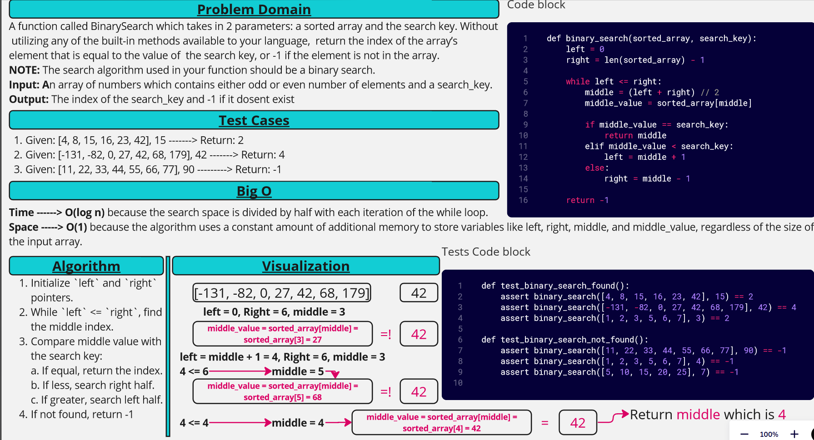

[&leftarrow; Back to Home](../README.md)

## Collabiration:

- Driver: **Almothana Almasri**
- Navigator: **Ayman Malkawi**

# Code Challenge: Binary Search

A function called `BinarySearch` which takes in 2 parameters: a `sorted array` and the `search key`. Without utilizing any of the built-in methods available to your language, return the index of the array’s element that is equal to the value of the `search key`, or -1 if the element is not in the array.
NOTE: The search algorithm used in your function should be a binary search.

## Whiteboard Process



## Approach & Efficiency

The binary search algorithm starts by initializing `left` and `right` pointers. It repeatedly divides the search interval in half by updating the pointers based on the `middle value's `comparison to the `search key`. If the middle value is equal to the `search key`, the middle index is returned. If the `middle value` is less than the `search key`, the search continues in the right half, and if it's greater, the search continues in the left half. If the value is not found, the function returns -1.

The time complexity of this approach is **O(log n)**, as the search interval is halved in each iteration. The space complexity is **O(1)**, as we use a constant amount of additional memory for variables.

## Solution

To run the code, simply call the function `binary_search(sorted_array, search_key)` with the desired array and value as arguments. For example:

```python
def binary_search(sorted_array, search_key):
    left = 0
    right = len(sorted_array) - 1

    while left <= right:
        middle = (left + right) // 2
        middle_value = sorted_array[middle]

        if middle_value == search_key:
            return middle
        elif middle_value < search_key:
            left = middle + 1
        else:
            right = middle - 1

    return -1

# Test cases
print(binary_search([4, 8, 15, 16, 23, 42], 15))     # Output: 2
print(binary_search([-131, -82, 0, 27, 42, 68, 179], 42))  # Output: 4
print(binary_search([11, 22, 33, 44, 55, 66, 77], 90))  # Output: -1
print(binary_search([1, 2, 3, 5, 6, 7], 4))  # Output: -1
```