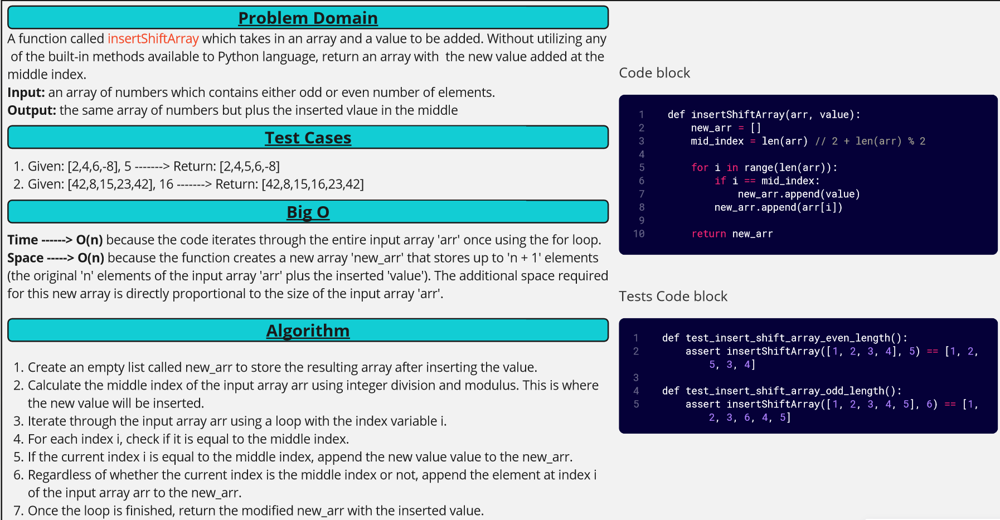

[&leftarrow; Back to Home](../README.md)

# Code Challenge: Insert Shift Array

A function that takes an array and a value, and inserts the value at the middle index of the array.

## Whiteboard Process



## Approach & Efficiency

We create a new empty list called `new_arr`, calculate the middle index of the input array, and iterate through the input array. We check if the current index is equal to the middle index, and if so, append the new value to the `new_arr`. We then append the element at the current index of the input array to the `new_arr`. The time complexity of this approach is O(n), and the space complexity is O(n)

## Solution

To run the code, simply call the function `insertShiftArray(arr, value)` with the desired array and value as arguments. For example:

```python
def insertShiftArray(arr, value):
    new_arr = []
    mid_index = len(arr) // 2 + len(arr) % 2
    
    for i in range(len(arr)):
        if i == mid_index:
            new_arr.append(value)
        new_arr.append(arr[i])
    
    return new_arr

arr1 = [2, 4, 6, -8]
value1 = 5
print(insertShiftArray(arr1, value1))  # Output: [2, 4, 5, 6, -8]

arr2 = [42, 8, 15, 23, 42]
value2 = 16
print(insertShiftArray(arr2, value2))  # Output: [42, 8, 15, 16, 23, 42]
```