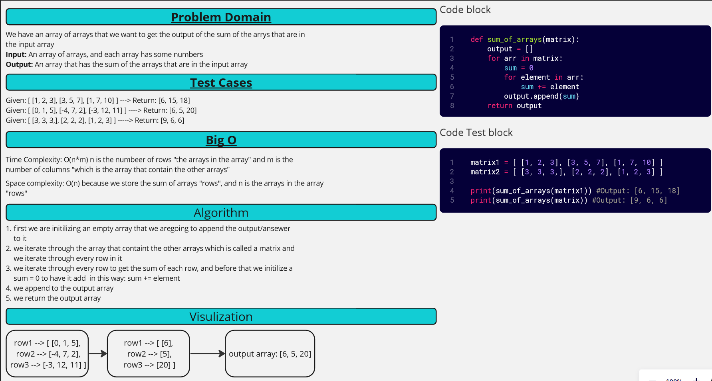

[&leftarrow; Back to Home](../README.md)

Author: **Almothana Almasri**

# Code Challenge: 04 

<!-- Description of the challenge -->

## Whiteboard Process

## Approach & Efficiency
<!-- What approach did you take? Why? What is the Big O space/time for this approach? -->

## Solution
<!-- Show how to run your code, and examples of it in action -->

