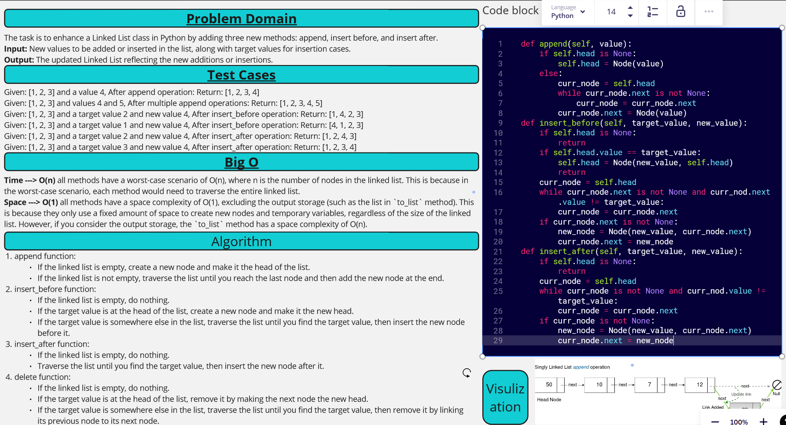

[&leftarrow; Back to Home](../README.md)

Author: **Almothana Almasri**

# Code Challenge: Linked List Insertions

Challenge Type:  Extending an Implementation. 
Write the following methods for the Linked List class: ***append, insert before, insert after***
---

## Whiteboard Process



## **Approach & Efficiency**

Approach:
1. `append`: This method traverses the linked list until it finds the last node, and then sets the `next` attribute of the last node to a new node with the given value.

2. `insert_before`: This method traverses the linked list until it finds a node whose `next` attribute is a node with the target value, and then sets the `next` attribute of the current node to a new node with the given value. The `next` attribute of the new node is set to the node with the target value.

3. `insert_after`: This method traverses the linked list until it finds a node with the target value, and then sets the `next` attribute of the current node to a new node with the given value. The `next` attribute of the new node is set to the `next` attribute of the node with the target value.

4. `delete`: This method traverses the linked list until it finds a node whose `next` attribute is a node with the target value, and then sets the `next` attribute of the current node to the `next` attribute of the node with the target value.

5. `to_list`: This method traverses the linked list and appends the value of each node to a list.

Efficiency:
In terms of time complexity, all methods have a worst-case scenario of O(n), where n is the number of nodes in the linked list. This is because in the worst-case scenario, each method would need to traverse the entire linked list.

In terms of space complexity, all methods have a space complexity of O(1), excluding the output storage (such as the list in `to_list` method). This is because they only use a fixed amount of space to create new nodes and temporary variables, regardless of the size of the linked list. However, if you consider the output storage, the `to_list` method has a space complexity of O(n).

---

## **Solution**

Check attached file ***[label](linked_list_insertions/linked_list_insertions.py)*** to see the Solution

## Setup

1. Create a virtual environment (optional):

```bash
python3 -m venv .venv
source .venv/bin/activate
```

2. Install required packages:

```bash
pip install -r requirements.txt
```

## Tests

```bash
pytest code_challange_class06/tests
```
For detailed information

```bash
pytest -v code_challange_class06/tests
```