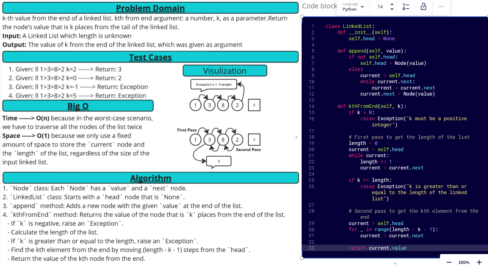

[&leftarrow; Back to Home](../README.md)

Author: **Almothana Almasri**

# Code Challenge: Class-07 k-th value from the end of a linked list.

Challenge Type:  k-th value from the end of a linked list.
kth from end argument: a number, k, as a parameter.Return the node’s value that is k places from the tail of the linked list.
You have access to the Node class and all the properties on the Linked List class as well as the methods created in previous challenges.

---

## Whiteboard Process



## **Approach & Efficiency**

The approach taken for this code is a straightforward one. 

1. For the `append` method, it simply checks if the list is empty and if so, creates a new node at the head. If not, it traverses the list until it finds the last node and appends a new node there. 

2. For the `kthFromEnd` method, it first checks if `k` is a negative number, throwing an exception if it is. It then makes a first pass through the linked list to calculate its length. If `k` is greater than or equal to the length of the list, it throws an exception. It then makes a second pass through the linked list to find and return the value of the node that is `k` places from the end.

### Efficiency
The time complexity of this approach is O(n), where n is the number of nodes in the linked list. This is because in the worst-case scenario, we have to traverse all the nodes of the list twice: once to calculate the length and a second time to find the kth element from the end.

The space complexity is O(1), which is constant. This is because we only use a fixed amount of space to store the `current` node and the `length` of the list, regardless of the size of the input linked list.

---

## **Solution**

Check attached file ***[linked_list_kth](linked_list_kth/linked_list_kth.py)*** to see the Solution

## Setup

1. Create a virtual environment (optional):

```bash
python3 -m venv .venv
source .venv/bin/activate
```

2. Install required packages:

```bash
pip install -r requirements.txt
```

## Tests

```bash
pytest code_challange_class07/tests/tests_linked_list_kth.py
```
For detailed information

```bash
pytest -v code_challange_class07/tests/tests_linked_list_kth.py
```