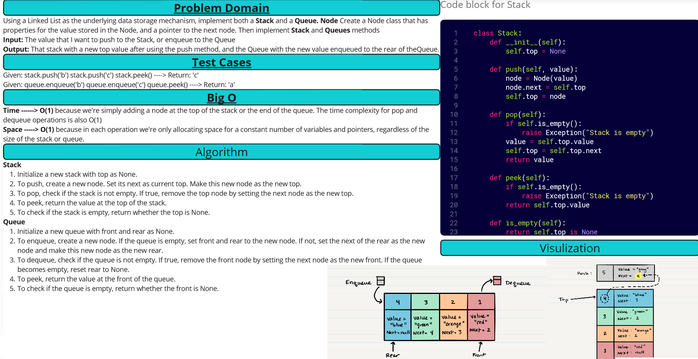

[&leftarrow; Back to Home](../README.md)

Author: **Almothana Almasri**

# Code Challenge: Class 10: Stack and a Queue Implementation.

Using a Linked List as the underlying data storage mechanism, implement both a Stack and a Queue
Node Create a Node class that has properties for the value stored in the Node, and a pointer to the next node.
Stack Create a Stack class that has a top property. It creates an empty Stack when instantiated. 

---

## Whiteboard Process



## **Approach & Efficiency**

## Approach

**Stack**

A stack is a linear data structure that follows the LIFO (Last In, First Out) principle. It has two main operations: 
- `push`: Add an element to the top of the stack.
- `pop`: Remove an element from the top of the stack.

Here, a linked list is used to store the elements of the stack. The `push` operation involves creating a new node and pointing it to the current top of the stack. The new node then becomes the top of the stack.

The `pop` operation involves removing the node at the top of the stack and making the next node the new top.

**Queue**

A queue is a linear data structure that follows the FIFO (First In, First Out) principle. It has two main operations:
- `enqueue`: Add an element to the end of the queue.
- `dequeue`: Remove an element from the start of the queue.

Again, a linked list is used to store the elements of the queue. The `enqueue` operation involves adding a new node to the rear of the queue. If the queue is empty, both the front and rear point to the new node.

The `dequeue` operation involves removing the node at the front of the queue and making the next node the new front. If this leaves the queue empty, both front and rear are set to `None`.

## Efficiency

- **Space Complexity**: The space complexity for both stack and queue operations is O(1), as in each operation we're only allocating space for a constant number of variables and pointers, regardless of the size of the stack or queue.

- **Time Complexity**: The time complexity for `push` and `enqueue` operations is O(1), as we're simply adding a node at the top of the stack or the end of the queue. The time complexity for `pop` and `dequeue` operations is also O(1), as we're simply removing a node from the top of the stack or the start of the queue. All these operations do not depend on the size of the stack or queue, and hence, they take constant time.

---

## **Solution**

Check attached file ***[Stack and Queue Python file](stack_and_queue/stack_and_queue.py)*** to see the Solution

## Setup

1. Create a virtual environment (optional):

```bash
python3 -m venv .venv
source .venv/bin/activate
```

2. Install required packages:

```bash
pip install -r requirements.txt
```

## Tests

```bash
pytest code_challange_class10/tests/tests_stack_and_queue.py
```
For detailed information

```bash
pytest -v code_challange_class10/tests/tests_stack_and_queue.py
```