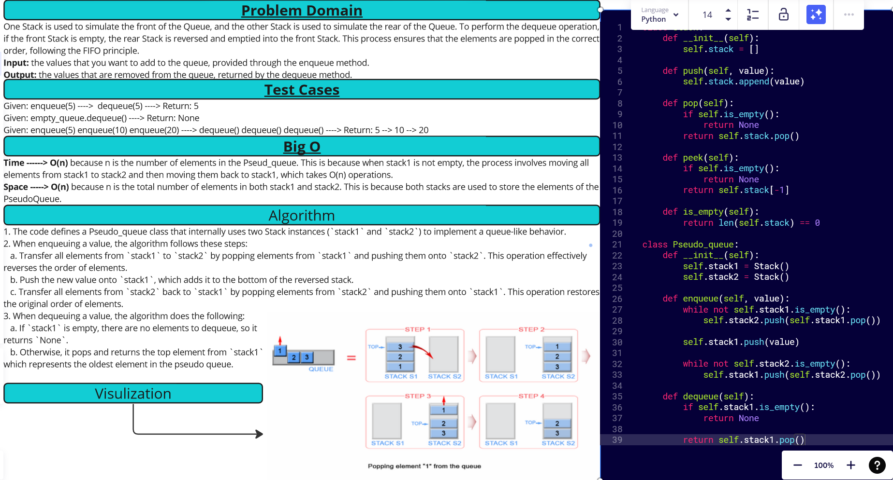

[&leftarrow; Back to Home](../README.md)

Author: **Almothana Almasri**

# Code Challenge: Class 11: Implement a Queue using two Stacks.

One Stack is used to simulate the front of the Queue, and the other Stack is used to simulate the rear of the Queue. To perform the dequeue operation, if the front Stack is empty, the rear Stack is reversed and emptied into the front Stack. This process ensures that the elements are popped in the correct order, following the FIFO principle.

---

## Whiteboard Process



## **Approach & Efficiency**

**Approach:**

Implement a PseudoQueue using two Stack instances (`stack1` and `stack2`). The `enqueue` operation follows the process of moving all elements from `stack1` to `stack2`, pushing the new value to `stack1`, and then moving all elements back from `stack2` to `stack1`. The `dequeue` operation simply pops and returns the top element from `stack1`. 

**Efficiency:**

The time complexity of the `enqueue` operation in the worst-case scenario is O(n), where n is the number of elements in the PseudoQueue. This is because when `stack1` is not empty, the process involves moving all elements from `stack1` to `stack2` and then moving them back to `stack1`, which takes O(n) operations. However, in the average case, when there are already elements in the PseudoQueue, the `enqueue` operation is more efficient, taking O(1) time complexity.

The time complexity of the `dequeue` operation is O(1) because it involves simply popping the top element from `stack1`.

The space complexity of the PseudoQueue implementation is O(n), where n is the total number of elements in both `stack1` and `stack2`. This is because both stacks are used to store the elements of the PseudoQueue.

---

## **Solution**

Check attached file ***[Pseudo Queeue](stack_queue_pseudo/stack_queue_pseudo.py)*** to see the Solution

## Setup

1. Create a virtual environment (optional):

```bash
python3 -m venv .venv
source .venv/bin/activate
```

2. Install required packages:

```bash
pip install -r requirements.txt
```

## Tests

```bash
pytest code_challange_class11/tests/tests_stack_queue_pseudo.py
```
For detailed information

```bash
pytest -v code_challange_class11/tests/tests_stack_queue_pseudo.py
```