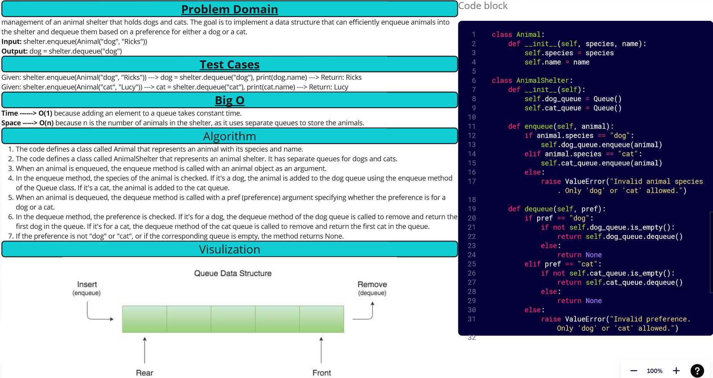

[&leftarrow; Back to Home](../README.md)

Author: **Almothana Almasri**

# Code Challenge: Class 12: First-in, First out Animal Shelter.

management of an animal shelter that holds dogs and cats. The goal is to implement a data structure that can efficiently enqueue animals into the shelter and dequeue them based on a preference for either a dog or a cat.

## Whiteboard Process



## Approach & Efficiency

For the AnimalShelter class, I used separate queues to maintain the order of dogs and cats that are enqueued. The enqueue operation simply adds the animal to the appropriate queue based on its species. The dequeue operation removes and returns the first dog or cat in the queue based on the preference. If the preference is not "dog" or "cat" or if the corresponding queue is empty, it returns `None`.

The time complexity of the enqueue operation is O(1) because adding an element to a queue takes constant time. The time complexity of the dequeue operation is also O(1) because removing the first element from a queue also takes constant time. The space complexity of the AnimalShelter class is O(n), where n is the number of animals in the shelter, as it uses separate queues to store the animals.

The efficiency of this approach is quite good as it provides constant time complexity for both enqueue and dequeue operations.

## **Solution**

Check attached file ***[Animal Shelter](animal_shelter/animal_shelter.py)*** to see the Solution

## Setup

1. Create a virtual environment (optional):

```bash
python3 -m venv .venv
source .venv/bin/activate
```

2. Install required packages:

```bash
pip install -r requirements.txt
```
3. Run

```bash
python code_challange_class12/animal_shelter/animal_shelter.py
```
