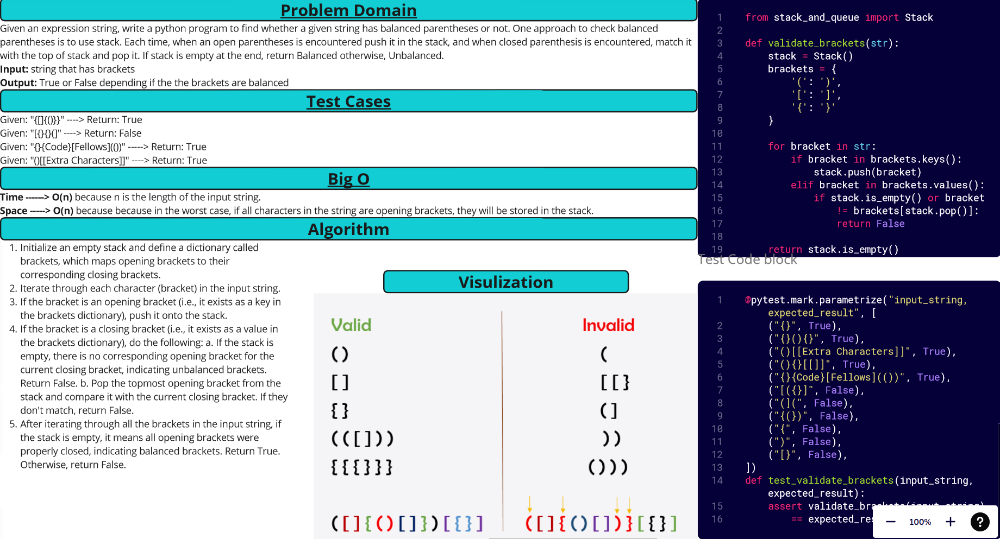

[&leftarrow; Back to Home](../README.md)

Author: **Almothana Almasri**

# Code Challenge: Class 13: Multi-bracket Validation.

Given an expression string, write a python program to find whether a given string has balanced parentheses or not. One approach to check balanced parentheses is to use stack. Each time, when an open parentheses is encountered push it in the stack, and when closed parenthesis is encountered, match it with the top of stack and pop it. If stack is empty at the end, return Balanced otherwise, Unbalanced. 

Examples:

Input : {[]{()}}
Output : Balanced

Input : [{}{}(]
Output : Unbalanced

---

## Whiteboard Process



## **Approach & Efficiency**

The approach taken in the code is to iterate through the characters of the input string and use a stack to keep track of the opening brackets encountered. Whenever a closing bracket is encountered, it is checked against the corresponding opening bracket at the top of the stack. If they match, the opening bracket is popped from the stack. If they don't match or the stack is empty, the brackets are considered unbalanced, and `False` is returned. At the end of the iteration, if the stack is empty, it means all opening brackets have been properly closed, and `True` is returned.

The time complexity of this approach is O(n), where n is the length of the input string. This is because we iterate through each character of the string once.

The space complexity is also O(n) because in the worst case, if all characters in the string are opening brackets, they will be stored in the stack.

---

## **Solution**

Check attached file ***[Multi-bracket Validation.](stack_queue_brackets/stack_queue_brackets.py)*** to see the Solution

## Setup

1. Create a virtual environment (optional):

```bash
python3 -m venv .venv
source .venv/bin/activate
```

2. Install required packages:

```bash
pip install -r requirements.txt
```

## Tests

```bash
pytest code_challange_class13/tests/test_stack_queue_brackets.py
```
For detailed information

```bash
pytest -v code_challange_class13/tests/test_stack_queue_brackets.py
```