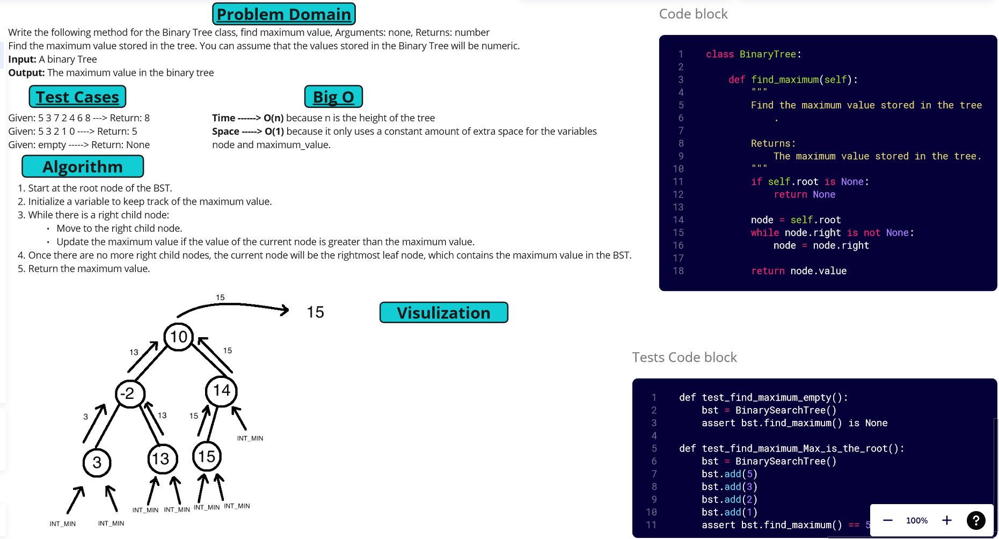

[&leftarrow; Back to Home](../README.md)

Author: **Almothana Almasri**

# Code Challenge: Class 16: Find the Maximum Value in a Binary Tree

Write the following method for the Binary Tree class

    find maximum value
        Arguments: none
        Returns: number

Find the maximum value stored in the tree. You can assume that the values stored in the Binary Tree will be numeric.

---

## Whiteboard



## Approach & Efficiency:

The `find_maximum` method in the `BinaryTree` class finds the maximum value stored in the tree. In the case of a binary search tree (BST), the maximum value is always present in the rightmost leaf node.

The time complexity of finding the maximum value in a BST using this approach is O(n), where n is the height of the tree.

The space complexity of the `find_maximum` method is O(1) since it only uses a constant amount of extra space for the variables `node` and `maximum_value`.

---

## **Solution**

```python
class BinaryTree:

    def find_maximum(self):
        """
        Find the maximum value stored in the tree.

        Returns:
            The maximum value stored in the tree.
        """
        if self.root is None:
            return None

        node = self.root
        while node.right is not None:
            node = node.right

        return node.value     
```

## Setup

1. Create a virtual environment (optional):

```bash
python3 -m venv .venv
source .venv/bin/activate
```

2. Install required packages:

```bash
pip install -r requirements.txt
```

## Tests

```bash
pytest code_challange_class16/tests/test_trees_max.py
```
For detailed information

```bash
pytest -v code_challange_class16/tests/test_trees_max.py
```