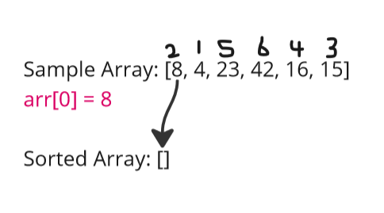
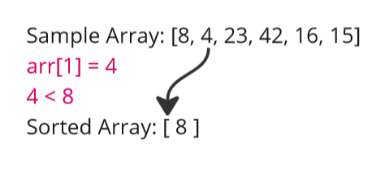
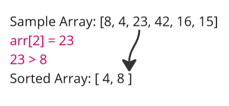
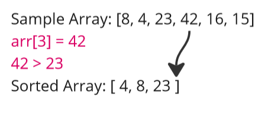
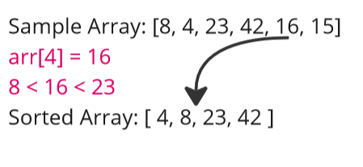
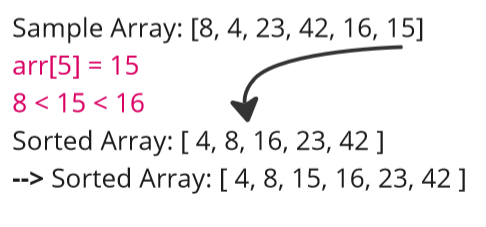

[&leftarrow; Back to Home](../README.md)

Author: **Almothana Almasri**

# Code Challenge: Class 26: Insertion Sort

In this blog article, we will explore the Insertion Sort algorithm and step through its execution for the given sample array [8, 4, 23, 42, 16, 15]. I will also provide a visual representation of the output at each iteration.

## Pseudocode

```pseudocode 
Insert(int[] sorted, int value)
  initialize i to 0
  WHILE value > sorted[i]
    set i to i + 1
  WHILE i < sorted.length
    set temp to sorted[i]
    set sorted[i] to value
    set value to temp
    set i to i + 1
  append value to sorted

InsertionSort(int[] input)
  LET sorted = New Empty Array
  sorted[0] = input[0]
  FOR i from 1 up to input.length
    Insert(sorted, input[i])
  return sorted
```

## Trace

Sample Array: [8,4,23,42,16,15]

***Pass 1:***

- Initially, the sorted array is empty, and the first element of the input array, 8, is added to the sorted array.
- The sorted array becomes [8].



***Pass 2:***

- The second element of the input array, 4, is evaluated.
- 4 is smaller than 8, so it is inserted before 8 in the sorted array.
- The sorted array becomes [4, 8].



***Pass 3:***

- The third element of the input array, 23, is evaluated.
- 23 is greater than 8, so it remains in its position.
- The sorted array remains [4, 8, 23].



***Pass 4:***

- The fourth element of the input array, 42, is evaluated.
- 42 is greater than 23, so it remains in its position.
- The sorted array remains [4, 8, 23, 42].



***Pass 5:***

- The fifth element of the input array, 16, is evaluated.
- 16 is smaller than 23 and greater than 8, so it is inserted between them.
- The sorted array becomes [4, 8, 16, 23, 42].



***Pass 6:***

- The sixth element of the input array, 15, is evaluated.
- 15 is smaller than 23 and 16, so it is inserted before 16.
- The sorted array becomes [4, 8, 15, 16, 23, 42].




**After completing the iterations, the Insertion Sort algorithm has sorted the input array, and the sorted array is [4, 8, 15, 16, 23, 42].**

## Python Code

```python
def insertion_sort(arr):
    sorted_arr = [arr[0]]
    for i in range(1, len(arr)):
        insert(sorted_arr, arr[i])
    return sorted_arr

def insert(sorted_arr, value):
    i = 0
    while value > sorted_arr[i]:
        i += 1
    while i < len(sorted_arr):
        temp = sorted_arr[i]
        sorted_arr[i] = value
        value = temp
        i += 1
    sorted_arr.append(value)
```

## Efficiency:

- **Time Complexity: O(n^2)**
    - The main loop in the `insertion_sort` function iterates through the input array once, resulting in O(n) time complexity.
    - The `insert` function also has a while loop that iterates through the sorted array, which has a maximum length of n (in the worst case).Therefore, the worst-case time complexity of the algorithm is O(n^2) since, in the worst case, each element needs to be compared with every element in the sorted array.


- **Space Complexity: O(1)**
    - The space complexity of the algorithm is constant O(1) since it does not use any additional space that grows with the input size.
    - The algorithm sorts the input array in place without requiring any extra memory allocation.

## Tests

[They are linked here](tests/test_insertion_sort.py)

```bash
pytest -v code_challange_class26/tests/test_insertion_sort.py
```