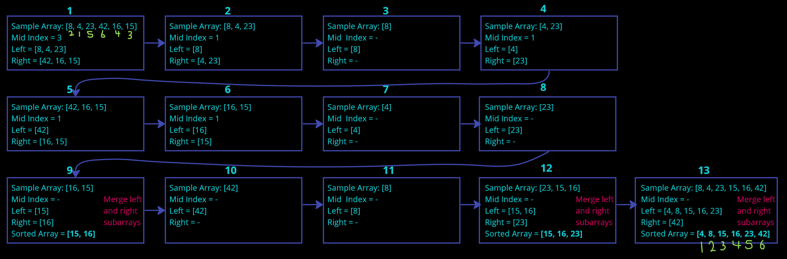

[&leftarrow; Back to Home](../README.md)

Author: **Almothana Almasri**

# Code Challenge: Class 27: Merge Sort

Merge Sort is a popular sorting algorithm that follows the divide-and-conquer approach. It divides the input array into smaller subarrays, recursively sorts them, and then merges the sorted subarrays to produce the final sorted output.

## Pseudocode

```pseudocode 
ALGORITHM Mergesort(arr)
    DECLARE n <-- arr.length

    if n > 1
      DECLARE mid <-- n/2
      DECLARE left <-- arr[0...mid]
      DECLARE right <-- arr[mid...n]
      // sort the left side
      Mergesort(left)
      // sort the right side
      Mergesort(right)
      // merge the sorted left and right sides together
      Merge(left, right, arr)

ALGORITHM Merge(left, right, arr)
    DECLARE i <-- 0
    DECLARE j <-- 0
    DECLARE k <-- 0

    while i < left.length && j < right.length
        if left[i] <= right[j]
            arr[k] <-- left[i]
            i <-- i + 1
        else
            arr[k] <-- right[j]
            j <-- j + 1

        k <-- k + 1

    if i = left.length
       set remaining entries in arr to remaining values in right
    else
       set remaining entries in arr to remaining values in left
```

## Trace

Sample Array: [8,4,23,42,16,15]



After the final iteration, the array is sorted, and the result is `[4, 8, 15, 16, 23, 42]`.

**After completing the iterations, the merge Sort algorithm has sorted the input array, and the sorted array is [4, 8, 15, 16, 23, 42].**

## Python Code

```python
def merge_sort(arr):
    n = len(arr)
    
    if n > 1:
        mid = n // 2
        left = arr[:mid]
        right = arr[mid:]
        
        merge_sort(left)
        merge_sort(right)
        
        merge(left, right, arr)

def merge(left, right, arr):
    i = j = k = 0

    while i < len(left) and j < len(right):
        if left[i] <= right[j]:
            arr[k] = left[i]
            i += 1
        else:
            arr[k] = right[j]
            j += 1
        k += 1

    while i < len(left):
        arr[k] = left[i]
        i += 1
        k += 1

    while j < len(right):
        arr[k] = right[j]
        j += 1
        k += 1
```

## Efficiency:

- **Time Complexity: O(n log n)**
  - The Merge Sort algorithm divides the input array into two halves recursively until each subarray contains a single element. This division takes O(log n) time because it repeatedly divides the array in half.
  - After dividing, the Merge operation merges the sorted subarrays, which takes O(n) time, where n is the total number of elements in the array.
  - Since the merging step occurs at each level of the recursion, the overall time complexity of Merge Sort is O(n log n).


- **Space Complexity: O(n)**
  - Merge Sort requires additional space for the temporary arrays used during the merging process.
  - In the worst case, when the recursion is at its deepest level, there are n/2 temporary arrays each of size 1, requiring O(n/2) or simply O(n) space.
  - Therefore, the space complexity of Merge Sort is O(n).

## Tests

[They are linked here](tests/test_merge_sort.py)

```bash
pytest -v code_challange_class27/tests/test_merge_sort.py
```