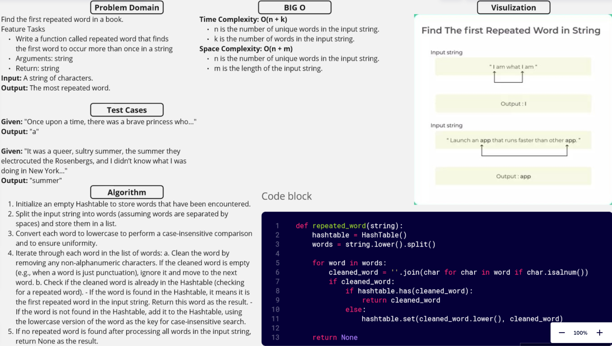

[&leftarrow; Back to Home](../README.md)

Author: **Almothana Almasri**

## Code Challenge: Class 31: Find the first repeated word in a book.

Write a function called repeated word that finds the first word to occur more than once in a string
Arguments: string
Return: string

## Whiteboard



## [Code is here](hashmap_repeated_word/hashmap_repeated_word.py)

## Approach

1. **Initialize Hashtable**: Create an empty Hashtable to store words that have been encountered.

2. **Split Words**: Split the input string into words (assuming words are separated by spaces) and store them in a list.

3. **Lowercase Conversion**: Convert each word to lowercase to perform a case-insensitive comparison and to ensure uniformity.

4. **Iterate through Words**:
    - a. **Clean Words**: For each word in the list of words, clean it by removing any non-alphanumeric characters. If the cleaned word is empty (e.g., when a word is just punctuation), ignore it and move to the next word.

    - b. **Check for Repeated Words**: Check if the cleaned word is already in the Hashtable, which serves as a lookup table for repeated words.
        - If the word is found in the Hashtable, it means it is the first repeated word in the input string. Return this word as the result.

        - If the word is not found in the Hashtable, add it to the Hashtable, using the lowercase version of the word as the key for case-insensitive search.

5. **Return Result**: If no repeated word is found after processing all words in the input string, return None as the result.

## Efficiency

### Time Complexity: O(n + k)

- `n` is the number of unique words in the input string.
- `k` is the number of words in the input string.

### Space Complexity: O(n + m)

- `n` is the number of unique words in the input string.
- `m` is the length of the input string.

## Tests

[They are linked here](tests/test_hashmap_repeated_word.py)

```bash
pytest -v code_challange_class31/tests/test_hashmap_repeated_word.py
```