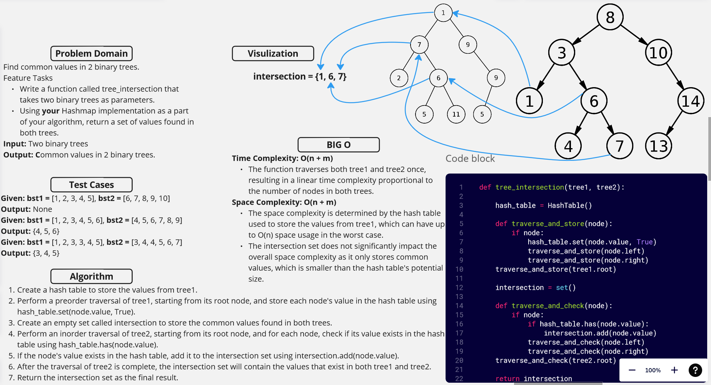

[&leftarrow; Back to Home](../README.md)

Author: **Almothana Almasri**

## Code Challenge: Class 32: Find common values in 2 binary trees.

Find common values in 2 binary trees.
Feature Tasks
Write a function called tree_intersection that takes two binary trees as parameters.
Using your Hashmap implementation as a part of your algorithm, return a set of values found in both trees.
Input: Two binary trees
Output: Common values in 2 binary trees.

## Whiteboard



## [Code is here](tree_intersection/tree_intersection.py)

## Approach

1. Create a hash table to store the values from `tree1`.
2. Perform a preorder traversal of `tree1`, starting from its root node, and store each node's value in the hash table using `hash_table.set(node.value, True)`.
3. Create an empty set called `intersection` to store the common values found in both trees.
4. Perform an inorder traversal of `tree2`, starting from its root node, and for each node, check if its value exists in the hash table using `hash_table.has(node.value)`.
5. If the node's value exists in the hash table, add it to the `intersection` set using `intersection.add(node.value)`.
6. After the traversal of `tree2` is complete, the `intersection` set will contain the values that exist in both `tree1` and `tree2`.
7. Return the `intersection` set as the final result.

## Efficiency

Time Complexity: O(n + m)
- The function traverses both `tree1` and `tree2` once, resulting in a linear time complexity proportional to the number of nodes in both trees.

Space Complexity: O(n)
- The space complexity is determined by the hash table used to store the values from `tree1`, which can have up to O(n) space usage in the worst case.
- The `intersection` set does not significantly impact the overall space complexity as it only stores common values, which is smaller than the hash table's potential size.

## Tests

[They are linked here](tests/test_tree_intersection.py)

```bash
pytest -v code_challange_class32/tests/test_tree_intersection.py
```