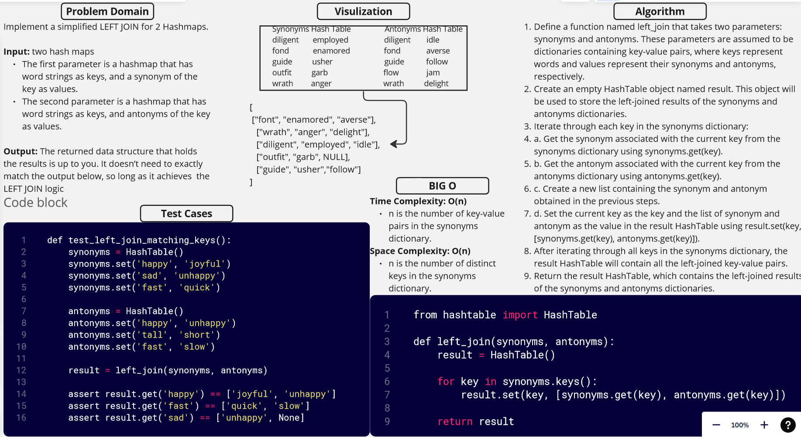

[&leftarrow; Back to Home](../README.md)

Author: **Almothana Almasri**

## Code Challenge: Class 33: Implement a simplified LEFT JOIN for 2 Hashmaps.

The purpose of this algorithm is to combine corresponding synonyms and antonyms from the two input dictionaries, `synonyms` and `antonyms`, into a single list of lists. If a key exists in both dictionaries, the corresponding synonym and antonym values will be included in the output list. If a key exists only in the `synonyms` dictionary, the corresponding antonym value in the output will be `None`.

## Whiteboard



## [Code is here](hashmap_left_join/hashmap_left_join.py)

## Approach

1. Import the `HashTable` class from the `hashtable` module.

2. Define a function named `left_join` that takes two parameters: `synonyms` and `antonyms`. These parameters are assumed to be dictionaries containing key-value pairs, where keys represent words and values represent their synonyms and antonyms, respectively.

3. Create an empty `HashTable` object named `result`. This object will be used to store the left-joined results of the `synonyms` and `antonyms` dictionaries.

4. Iterate through each key in the `synonyms` dictionary:

    a. Get the synonym associated with the current key from the `synonyms` dictionary using `synonyms.get(key)`.
    
    b. Get the antonym associated with the current key from the `antonyms` dictionary using `antonyms.get(key)`.
    
    c. Create a new list containing the synonym and antonym obtained in the previous steps.

    d. Set the current key as the key and the list of synonym and antonym as the value in the `result` HashTable using `result.set(key, [synonyms.get(key), antonyms.get(key)])`.

5. After iterating through all keys in the `synonyms` dictionary, the `result` HashTable will contain all the left-joined key-value pairs.

6. Return the `result` HashTable, which contains the left-joined results of the `synonyms` and `antonyms` dictionaries.

## Efficiency

**Time Complexity:** O(N)  
The algorithm iterates through the keys in the `synonyms` dictionary once, where N is the number of keys in the dictionary.

**Space Complexity:** O(N)  
The space complexity is determined by the size of the `result` list, which grows linearly with the number of keys in the `synonyms` dictionary.

## Tests

[They are linked here](tests/test_hashmap_left_join.py)

```bash
pytest -v code_challange_class33/tests/test_hashmap_left_join.py
```