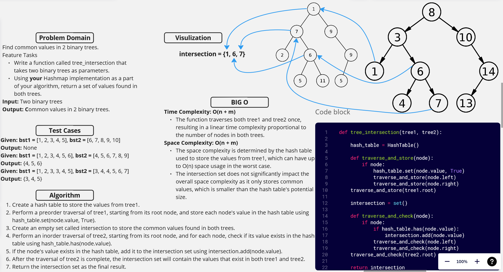

[&leftarrow; Back to Home](../README.md)

Author: **Almothana Almasri**

## Code Challenge: Class 33: Implement a simplified LEFT JOIN for 2 Hashmaps.

The purpose of this algorithm is to combine corresponding synonyms and antonyms from the two input dictionaries, `synonyms` and `antonyms`, into a single list of lists. If a key exists in both dictionaries, the corresponding synonym and antonym values will be included in the output list. If a key exists only in the `synonyms` dictionary, the corresponding antonym value in the output will be `None`.

## Whiteboard



## [Code is here](hashmap_left_join/hashmap_left_join.py)

## Approach

Step 1: Create a function named `left_join` that takes two dictionaries, `synonyms` and `antonyms`, as input.

Step 2: Initialize an empty list named `result` to store the final output.

Step 3: Iterate through the keys in the `synonyms` dictionary using a `for` loop:

```
for key in synonyms:
```

Step 4: Retrieve the value associated with the current key in the `synonyms` dictionary:

```
    synonym_value = synonyms[key]
```

Step 5: Check if the current key exists in the `antonyms` dictionary:

```
    if key in antonyms:
```

Step 6: If the key exists in the `antonyms` dictionary, get the value associated with that key:

```
        antonym_value = antonyms[key]
```

Step 7: If the key doesn't exist in the `antonyms` dictionary, set the `antonym_value` to `None`:

```
    else:
        antonym_value = None
```

Step 8: Append a list containing the key, `synonym_value`, and `antonym_value` to the `result` list:

```
    result.append([key, synonym_value, antonym_value])
```

Step 9: After iterating through all keys in the `synonyms` dictionary, return the `result` list as the final output:

```
return result
```

## Efficiency

**Time Complexity:** O(N)  
The algorithm iterates through the keys in the `synonyms` dictionary once, where N is the number of keys in the dictionary.

**Space Complexity:** O(N)  
The space complexity is determined by the size of the `result` list, which grows linearly with the number of keys in the `synonyms` dictionary.

## Tests

[They are linked here](tests/test_hashmap_left_join.py)

```bash
pytest -v code_challange_class33/tests/test_hashmap_left_join.py
```