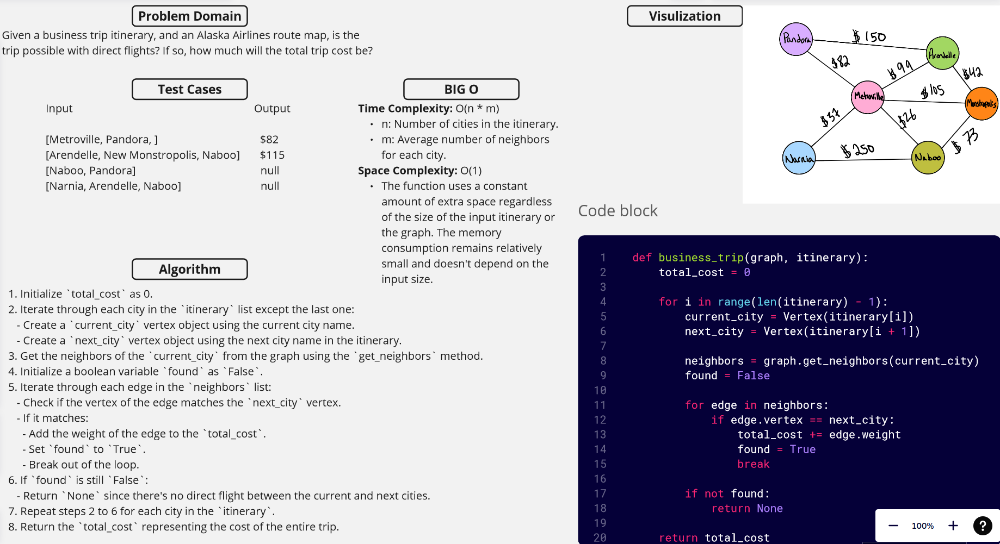

[&leftarrow; Back to Home](../README.md)

Author: **Almothana Almasri**

## Code Challenge: Class 38: Graph Business Trip.

Given a business trip itinerary, and an Alaska Airlines route map, is the trip possible with direct flights? If so, how much will the total trip cost be?

## [Code is here](business_trip/business_trip.py)

## Whiteboard



## Approach

1. Initialize `total_cost` as 0.

2. Iterate through each city in the `itinerary` list except the last one:
   - Create a `current_city` vertex object using the current city name.
   - Create a `next_city` vertex object using the next city name in the itinerary.

3. Get the neighbors of the `current_city` from the graph using the `get_neighbors` method.

4. Initialize a boolean variable `found` as `False`.

5. Iterate through each edge in the `neighbors` list:
   - Check if the vertex of the edge matches the `next_city` vertex.
   - If it matches:
     - Add the weight of the edge to the `total_cost`.
     - Set `found` to `True`.
     - Break out of the loop.

6. If `found` is still `False`:
   - Return `None` since there's no direct flight between the current and next cities.

7. Repeat steps 2 to 6 for each city in the `itinerary`.

8. Return the `total_cost` representing the cost of the entire trip.

## Efficiency

**Time Complexity:** O(n * m)
- n: Number of cities in the itinerary.
- m: Average number of neighbors for each city.

**Space Complexity:** O(1)
- The function uses a constant amount of extra space regardless of the size of the input itinerary or the graph. The memory consumption remains relatively small and doesn't depend on the input size.

## Tests

[They are linked here](tests/test_business_trip.py)

```bash
pytest -v code_challange_class37/tests/test_business_trip.py
```