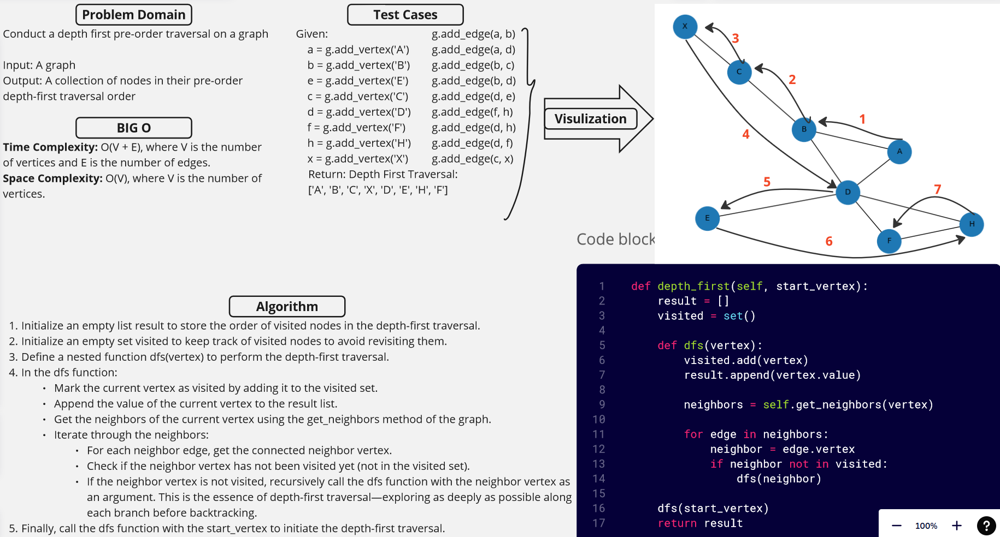

[&leftarrow; Back to Home](../README.md)

Author: **Almothana Almasri**

## Code Challenge: Class 38: Conduct a depth first pre-order traversal on a graph

Write the following method for the Graph class:

    Name: Depth first
    Arguments: Node (Starting point of search)
    Return: A collection of nodes in their pre-order depth-first traversal order
    Program output: Display the collection


## [Code is here](business_trip/depth_first.py)

## Whiteboard



## Approach

1. Initialize an empty list `result` to store the order of visited nodes in the depth-first traversal.
2. Initialize an empty set `visited` to keep track of visited nodes to avoid revisiting them.
3. Define a nested function `dfs(vertex)` to perform the depth-first traversal.
4. In the `dfs` function:
   - Mark the current `vertex` as visited by adding it to the `visited` set.
   - Append the value of the current `vertex` to the `result` list.
   - Get the neighbors of the current `vertex` using the `get_neighbors` method of the graph.
   - Iterate through the neighbors:
     - For each neighbor edge, get the connected `neighbor` vertex.
     - Check if the `neighbor` vertex has not been visited yet (not in the `visited` set).
     - If the `neighbor` vertex is not visited, recursively call the `dfs` function with the `neighbor` vertex as an argument. This is the essence of depth-first traversal—exploring as deeply as possible along each branch before backtracking.
5. Finally, call the `dfs` function with the `start_vertex` to initiate the depth-first traversal.

## Efficiency

**Time Complexity:** O(V + E), where V is the number of vertices and E is the number of edges.

**Space Complexity:** O(V), where V is the number of vertices.

## Tests

[They are linked here](tests/test_depth_first.py)

```bash
pytest -v code_challange_class38/tests/test_depth_first.py
```